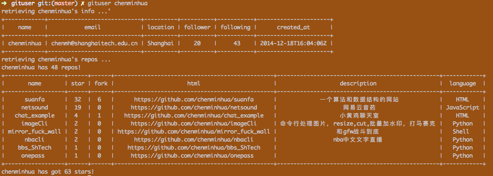

a command line tool for check github user's info.


## installation

### python user
```sh
pip install gituser
```

### golang user
```sh
go get github.com/chenminhua/gituser
```

## usage
```sh
gituser chenminhua
```

## github api
[github api](https://developer.github.com/v3/)
for this project, I use "/users/:username" to get user's basic info.
Then I use "/user/repos" to get infos of user's repos.
Because of the pagination, We can only get 30 repos for each request.
Fortunately, we can easily write concurrency code with python or go.  

## License
just take what you want
